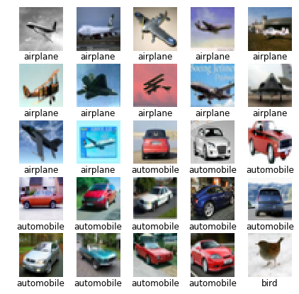
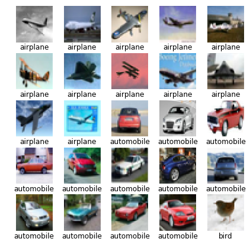

```python
import h5py
import os
import numpy as np

def unpickle(file):
    import cPickle
    with open(file, 'rb') as fo:
        dict = cPickle.load(fo)
    return dict

file = h5py.File('processed_data.h5','r+') 

#Retrieves all the preprocessed training and validation\testing data from a file

X_train = file['X_train'][...]
Y_train = file['Y_train'][...]
X_test = file['X_test'][...]
Y_test = file['Y_test'][...]

# Unpickles and retrieves class names and other meta informations of the database
classes = unpickle('cifar-10-batches-py/batches.meta') #keyword for label = label_names

# The steps below are completely unncessary. A long time ago, I put some modified version of X_train and X_test 
# into the X_train_feed and X_test_feed variables but things changed since then (as in I discarded those modifications). 
# But even though things changedit was difficult to change back all variables X_train_feed and X_test_feed 
# that are used later on the code to X_train and X_test which is why I made these unnecessary steps to put X_train and X_test
# into X_train_feed and X_test_feed

X_train_feed = X_train
X_test_feed = X_test

print("Training sample shapes (input and output): "+str(X_train.shape)+" "+str(Y_train.shape))
print("Testing sample shapes (input and output): "+str(X_test.shape)+" "+str(Y_test.shape))

```

    Training sample shapes (input and output): (50000, 32, 32, 3) (50000, 10)
    Testing sample shapes (input and output): (10000, 32, 32, 3) (10000, 10)


```python
# Creates nested list. The outer list will list all the classess (0-9). And each of the classes represent the inner list which list all
#training data that belongs to that class. I used list because it is easy to keep on adding dynamically. Ndarrays may have needed 
#a predifined shape

classes_num = len(classes['label_names']) #classes_num = no. of classes

# Here, I am creating a special variable X_train_F which is basically a nested list.
# The outermost list of X_train_F will be a list of all the class values (0-9 where each value correspond to a class name)
# Each elements (class values) of the outermost list is actually also a list; a list of all the example data belonging
# to the particular class which corresponds to class value under which the data is listed. 

X_train_F = []

for i in xrange(0,classes_num):
    X_train_F.append(str(i))
    X_train_F[i]=[]


for i in xrange(0,len(X_train)):
    l = int(np.argmax(Y_train[i])) #l for label (in this case it's basically the index of class value elemenmts)  
    #(Y_train is one hot encoded. Argmax returns the index for maximum value which should be 1 and
    # that index should indicate the value)
    X_train_F[l].append(X_train[i])
    
```


```python
import matplotlib.pyplot as plt
from scipy.misc import toimage
from scipy.misc import imresize
%matplotlib inline

#function for showing pictures in grid along with labels

def picgrid(X_train,Y_train,gray=0):
    plt.figure(figsize=(7,7))
    ax=[]
    for i in xrange(0,25):
        img = toimage(X_train[i])
        ax.append(plt.subplot(5,5,i+1))
        ax[i].set_title( classes['label_names'][int(np.argmax(Y_train[i]))],y=-0.3)
        ax[i].set_axis_off()
        if gray==0:
            plt.imshow(img)
        else:
            plt.imshow(img,cmap='gray')
    plt.subplots_adjust(hspace=0.3)
    plt.axis('off')
    plt.show()
```


```python
import random

def create_batch(batch_size,classes_num):
   
    s = int(batch_size/classes_num) #s denotes samples taken from each class to create the batch.
    l = np.zeros((classes_num))
    ran = []
    batch_Y = np.zeros((Y_train.shape))
    batch_X = np.zeros(((s*classes_num),32,32,3)) # s*classes_num = batch size reduced to the closest integer 
                                                  # divisible by classes_num if not divisble to begin with.

    for i in xrange(0,classes_num):
        l[i] = len(X_train_F[i])
        ran.append(random.sample(np.arange(1,l[i],1,'int'), s)) # Choose s no. of random samples from each class
        #print ran[i]
        for j in xrange(0,s):
            batch_X[(i*s)+j] = X_train_F[i][int(ran[i][j])] # Assign the s chosen random samples to the training batch
            batch_Y[(i*s)+j][i] = 1 # Creates one hot encoded batch of output samples
    
    return batch_X,batch_Y

batch_X,batch_Y = create_batch(120,classes_num) # A demo of the function at work

# Since each batch will have equal no. of cases from each class, no batch should be biased towards some particular classes

print "Sample arranged images in a batch: "
picgrid(batch_X,batch_Y)
```

    Sample arranged images in a batch: 





```python
"""def random_crop(img):
    c = np.random.randint(0,5)
    if c==0:
        crop = img[8:32,0:-8]
    elif c==1:
        crop = img[0:-8,0:-8]
    elif c==2:
        crop = img[4:-4,4:-4]
    elif c==3:
        crop = img[8:32,8:32]
    elif c==4:
        crop = img[0:-8,8:32]
    return crop"""

def augment_batch(batch_X): #will be used to modify images realtime during training (real time data augmentation)
    
    aug_batch_X = np.zeros((len(batch_X),32,32,3))
   
    for i in xrange(0,len(batch_X)):
        
        hf = np.random.randint(0,2)
        
        if hf == 1: #hf denotes horizontal flip. 50-50 random chance to apply horizontal flip on images,
            batch_X[i] = np.fliplr(batch_X[i])
       
        # Remove the below cropping to apply random crops. But before that it's better to implement something like mirror padding
        # or any form of padding to increase the dimensions beforehand.
        
        """c = np.random.randint(0,5)
        if c==4:
           #crop randomly to 24x24
            aug_batch_X[i] = imresize(toimage(random_crop(batch_X[i])),(32,32))
        else:
            aug_batch_X[i] = batch_X[i]"""
    
    return batch_X
    
    
aug_batch_X = augment_batch(batch_X)

print "Sample batch training images after light augmentation (50% chance of horizontal flips):"
picgrid(aug_batch_X,batch_Y)
```

    Sample batch training images after light augmentation (50% chance of horizontal flips):





```python
def shuffle_batch(batch_X,batch_Y):
    shuffle = random.sample(np.arange(0,len(batch_X),1,'int'),len(batch_X))
    shuffled_batch_X = []
    shuffled_batch_Y = []
    
    for i in xrange(0,len(batch_X)):
        shuffled_batch_X.append(batch_X[int(shuffle[i])])
        shuffled_batch_Y.append(batch_Y[int(shuffle[i])])
    
    shuffled_batch_X = np.array(shuffled_batch_X)
    shuffled_batch_Y = np.array(shuffled_batch_Y)

    return shuffled_batch_X,shuffled_batch_Y

s_batch_X, s_batch_Y = shuffle_batch(aug_batch_X,batch_Y)


print "Sample batch training images after shuffling"
picgrid(s_batch_X,s_batch_Y)
```

    Sample batch training images after shuffling


```python
def batch(batch_size): #one shortcut function to execute all necessary functions to create a training batch
    batch_X,batch_Y = create_batch(batch_size,classes_num)
    aug_batch_X = augment_batch(batch_X)
    s_batch_X,s_batch_Y = shuffle_batch(aug_batch_X,batch_Y)
    return s_batch_X.reshape((len(batch_X),32,32,3)),s_batch_Y
```


```python
import tensorflow as tf

FLAGS = tf.app.flags.FLAGS
# Basic model parameters.
tf.app.flags.DEFINE_boolean('use_fp16', False,
                            """Train the model using fp16.""")

```


```python
#Hyper Parameters!

learning_rate = 0.01
batch_size = 120
training_iters = 200*(int(len(X_train)/batch_size))
layers = 16


# 1 conv + 3 convblocks*(3 conv layers *1 group for each block + 2 conv layers*(N-1) groups for each block [total 1+N-1 = N groups]) = layers
# 3*2*(N-1) = layers - 1 - 3*3
# N = (layers -10)/6 + 1

N = ((layers-10)/6)+1
K = 4 #(deepening factor)

#(N and K are used in the same sense as defined here: https://arxiv.org/abs/1605.07146)

n_classes = classes_num # another useless step that I made due to certain reasons. 

# tf Graph input

x = tf.placeholder(tf.float32, [None, 32, 32, 3])
y = tf.placeholder(tf.float32, [None, n_classes])

keep_prob = tf.placeholder(tf.float32) #dropout (keep probability)
phase = tf.placeholder(tf.bool, name='phase') 
# (Phase = true means training is undergoing. The contrary is ment when Phase is false.)
```


```python
# Create some wrappers for simplicity

def conv2d(x,shape,strides):
    # Conv2D wrapper
    W = tf.Variable(tf.truncated_normal(shape=shape,stddev=5e-2))
    x = tf.nn.conv2d(x, W, strides=[1, strides, strides, 1], padding='SAME')
    # Didn't add bias because I read somewhere it's not necessary to add a bias if batch normalization is to be performed later
    # May be add L2 regularization or something here if you wish to.
    return x

def activate(x,phase):
    #wrapper for performing batch normalization and relu activation
    x = tf.contrib.layers.batch_norm(x, center=True, scale=True,variables_collections=["batch_norm_non_trainable_variables_collection"],updates_collections=None, decay=0.9,is_training=phase,zero_debias_moving_mean=True, fused=True)
    return tf.nn.relu(x,'relu')


def wideres33block(X,N,K,iw,bw,s,dropout,phase):
    
    # Creates N no. of 3,3 type residual blocks with dropout that consitute the conv2/3/4 blocks
    # with widening factor K and X as input. s is stride and bw is base width (no. of filters before multiplying with k)
    # iw is input width.
    # (see https://arxiv.org/abs/1605.07146 paper for details on the block)
    # In this case, dropout = probability to keep the neuron enabled.
    # phase = true when training, false otherwise.
    
    conv33_1 = conv2d(X,[3,3,iw,bw*K],s)
    conv33_1 = activate(conv33_1,phase)
    
    conv33_1 = tf.nn.dropout(conv33_1,dropout)
    
    conv33_2 = conv2d(conv33_1,[3,3,bw*K,bw*K],1)
    conv_s_1 = conv2d(X,[1,1,iw,bw*K],s) #shortcut connection
    
    caddtable = tf.add(conv33_2,conv_s_1)
    
    #1st of the N blocks for conv2/3/4 block ends here. The rest of N-1 blocks will be implemented next with a loop.

    for i in range(0,N-1):
        
        C = caddtable
        Cactivated = activate(C,phase)
        
        conv33_1 = conv2d(Cactivated,[3,3,bw*K,bw*K],1)
        conv33_1 = activate(conv33_1,phase)
        
        conv33_1 = tf.nn.dropout(conv33_1,dropout)
            
        conv33_2 = conv2d(conv33_1,[3,3,bw*K,bw*K],1)
        caddtable = tf.add(conv33_2,C)
    
    return activate(caddtable,phase)


    
def WRN(x, dropout, phase): #Wide residual network

    conv1 = conv2d(x,[3,3,3,16],1)
    conv1 = activate(conv1,phase)

    conv2 = wideres33block(conv1,N,K,16,16,1,dropout,phase)
    conv3 = wideres33block(conv2,N,K,16*K,32,2,dropout,phase)
    conv4 = wideres33block(conv3,N,K,32*K,64,2,dropout,phase)

    pooled = tf.nn.avg_pool(conv4,ksize=[1,8,8,1],strides=[1,1,1,1],padding='VALID')
    
    #Initialize weights and biases for fully connected layers
    wd1 = tf.Variable(tf.truncated_normal([1*1*64*K, 64*K],stddev=5e-2))
    bd1 = tf.Variable(tf.constant(0.1,shape=[64*K]))
    wout = tf.Variable(tf.random_normal([64*K, n_classes]))
    bout = tf.Variable(tf.constant(0.1,shape=[n_classes]))

    # Fully connected layer
    # Reshape pooling layer output to fit fully connected layer input
    
    fc1 = tf.reshape(pooled, [-1, wd1.get_shape().as_list()[0]])   
    fc1 = tf.add(tf.matmul(fc1, wd1), bd1)
    fc1 = tf.nn.relu(fc1)

    #fc1 = tf.nn.dropout(fc1, dropout) #Not sure if I should or should not apply dropout here.
    
    # Output, class prediction
    out = tf.add(tf.matmul(fc1, wout), bout)
    
    return out
```


```python
# Construct model
model = WRN(x,keep_prob,phase)

# Define loss and optimizer

cost = tf.reduce_mean(tf.nn.softmax_cross_entropy_with_logits(logits=model, labels=y))

global_step = tf.Variable(0)
optimizer = tf.train.MomentumOptimizer(learning_rate=learning_rate, momentum = 0.9, use_nesterov=True).minimize(cost,global_step=global_step)

#learning_rate = tf.train.exponential_decay(init_lr,global_step*batch_size, decay_steps=len(X_train), decay_rate=0.95, staircase=True)

# Evaluate model
correct_pred = tf.equal(tf.argmax(model, 1), tf.argmax(y, 1))
accuracy = tf.reduce_mean(tf.cast(correct_pred, tf.float32))
prediction = tf.nn.softmax(logits=model)

# Initializing the variables
init = tf.global_variables_initializer()
```


```python

with tf.Session() as sess: # Start Tensorflow Session
    
    saver = tf.train.Saver() # Prepares variable for saving the model
    sess.run(init) #initialize all variables
    step = 1   
    loss_list=[]
    acc_list=[]
    val_loss_list=[]
    val_acc_list=[]
    best_val_acc=0
    total_loss=0
    total_acc=0
    display_step=int(len(X_train)/batch_size) 
    # (Interval after which average training accuracy and validation accuracy is displayed)
    
    bit_too_many_iterations = 100000 # Maximum iterations that shouldn't be surpassed in any circumstances 
    
    max_patience = 5  # No. of consecutive iterations for which the program will endure 
                      # the best validation accuracy not being surpassed
                      # if the minimum acceptable accuracy is reached
    
    patience = 0 # No. of consecutive iterations for which the best validation accuracy is not surpassed

    flag = 0
    
    min_acceptable_acc = 0.9 # (min_acceptable_acc*100)% = Minimum Acceptable Accuracy in Percentage
                             # If minimum acceptable accuracy is not reached at the end of iterations,
                             # iterations will be increased as long as it's <= bit_too_many_iterations.
    
    while step <= training_iters:
        
        batch_x, batch_y = batch(batch_size)
        
        # A very basic implementation of learning rate scheduling. 
        if step == 100*(int(len(X_train)/batch_size)):
            print "\nDecreasing Learning Rate to 0.001"
            learning_rate = 0.001
 
        # Run optimization operation (backpropagation)
        _,loss,acc = sess.run([optimizer,cost,accuracy],feed_dict={x: batch_x, y: batch_y, keep_prob: 0.7, phase: True})
        
        total_loss += loss
        total_acc += acc
                
        if step%100 == 0:
            print "Iter " + str(step) + ", Minibatch Loss= " + \
                  "{:.3f}".format(loss) + ", Minibatch Accuracy= " + \
                  "{:.3f}%".format(acc*100)

        if step % display_step == 0:
                      
            total_val_loss=0
            total_val_acc=0
            val_loss=0
            val_acc=0
            avg_val_loss=0
            avg_val_acc=0
            
            for i in xrange(0,len(X_test_feed)):
                val_loss, val_acc = sess.run([cost, accuracy], feed_dict={x: X_test_feed[i].reshape((1,32,32,3)),
                                                                      y: Y_test[i].reshape((1,n_classes)),
                                                                      keep_prob: 1,
                                                                      phase: False})

                total_val_loss= total_val_loss+val_loss
                total_val_acc = total_val_acc+val_acc
                
            avg_val_loss = total_val_loss/len(X_test_feed) # Average validation loss
            avg_val_acc = total_val_acc/len(X_test_feed) # Average validation accuracy
             
            val_loss_list.append(avg_val_loss) # Storing values in list for plotting later on.
            val_acc_list.append(avg_val_acc) # Storing values in list for plotting later on.
            
            avg_loss = total_loss/int(display_step) # Average mini-batch training loss
            avg_acc = total_acc/int(display_step)  # Average mini-batch training accuracy
            
            loss_list.append(avg_loss) # Storing values in list for plotting later on.
            acc_list.append(avg_acc) # Storing values in list for plotting later on.
            
            total_loss=0
            total_acc=0

            print "\nIter " + str(step) + ", Validation Loss= " + \
                    "{:.3f}".format(avg_val_loss) + ", validation Accuracy= " + \
                    "{:.3f}%".format(avg_val_acc*100)+""
            print "Iter " + str(step) + ", Average Training Loss= " + \
                    "{:.3f}".format(avg_loss) + ", Average Training Accuracy= " + \
                    "{:.3f}%".format(avg_acc*100)+""
                    
            if avg_val_acc > best_val_acc: # When better accuracy is received than previous best validation accuracy
                
                best_val_acc = avg_val_acc # update value of best validation accuracy received yet.
                saver.save(sess, 'Model_Backup/model.ckpt') # save_model including model variables (weights, biases etc.)
                print "Checkpoint created!"
                patience = 0 # Reset patience value 
                
            else:
                patience += 1 
                
            if patience >= max_patience and best_val_acc >= min_acceptable_acc:
                flag = 1
                
                
            print ""
            
            if best_val_acc < min_acceptable_acc and step <= bit_too_many_iterations and step == training_iters:
                print "\nAdding iterations since minimum acceptable accuracy is not achieved!\n"
                training_iters += 1000
            
            
        if flag == 1:
            print "\nStopping early since accuracy not increasing!\n"
            break
            
        step += 1
        
    print "\nOptimization Finished!\n"
    
    print "Best Test Accuracy: %.3f%%"%((best_val_acc)*100)
     
    
```

    Iter 100, Minibatch Loss= 2.144, Minibatch Accuracy= 23.333%
    Iter 200, Minibatch Loss= 1.980, Minibatch Accuracy= 24.167%
    Iter 300, Minibatch Loss= 1.756, Minibatch Accuracy= 34.167%
    Iter 400, Minibatch Loss= 1.606, Minibatch Accuracy= 45.833%
    
    Iter 416, Validation Loss= 1.646, validation Accuracy= 39.490%
    Iter 416, Average Training Loss= 2.404, Average Training Accuracy= 26.997%
    Checkpoint created!
    
    Iter 500, Minibatch Loss= 1.601, Minibatch Accuracy= 43.333%
    Iter 600, Minibatch Loss= 1.663, Minibatch Accuracy= 40.833%
    Iter 700, Minibatch Loss= 1.346, Minibatch Accuracy= 52.500%
    Iter 800, Minibatch Loss= 1.654, Minibatch Accuracy= 39.167%
    
    Iter 832, Validation Loss= 1.494, validation Accuracy= 47.530%
    Iter 832, Average Training Loss= 1.518, Average Training Accuracy= 44.233%
    Checkpoint created!
    
    Iter 900, Minibatch Loss= 1.324, Minibatch Accuracy= 51.667%
    Iter 1000, Minibatch Loss= 1.361, Minibatch Accuracy= 47.500%
    Iter 1100, Minibatch Loss= 1.109, Minibatch Accuracy= 57.500%
    Iter 1200, Minibatch Loss= 1.035, Minibatch Accuracy= 62.500%
    
    Iter 1248, Validation Loss= 1.204, validation Accuracy= 57.520%
    Iter 1248, Average Training Loss= 1.268, Average Training Accuracy= 54.002%
    Checkpoint created!
    
    Iter 1300, Minibatch Loss= 1.234, Minibatch Accuracy= 55.000%
    Iter 1400, Minibatch Loss= 1.172, Minibatch Accuracy= 52.500%
    Iter 1500, Minibatch Loss= 1.113, Minibatch Accuracy= 63.333%
    Iter 1600, Minibatch Loss= 1.163, Minibatch Accuracy= 59.167%
    
    Iter 1664, Validation Loss= 1.015, validation Accuracy= 63.910%
    Iter 1664, Average Training Loss= 1.078, Average Training Accuracy= 61.266%
    Checkpoint created!
    
    Iter 1700, Minibatch Loss= 0.811, Minibatch Accuracy= 68.333%
    Iter 1800, Minibatch Loss= 1.016, Minibatch Accuracy= 61.667%
    Iter 1900, Minibatch Loss= 0.975, Minibatch Accuracy= 66.667%
    Iter 2000, Minibatch Loss= 0.974, Minibatch Accuracy= 65.000%
    
    Iter 2080, Validation Loss= 0.970, validation Accuracy= 66.250%
    Iter 2080, Average Training Loss= 0.970, Average Training Accuracy= 65.184%
    Checkpoint created!
    
    Iter 2100, Minibatch Loss= 1.094, Minibatch Accuracy= 58.333%
    Iter 2200, Minibatch Loss= 0.813, Minibatch Accuracy= 69.167%
    Iter 2300, Minibatch Loss= 0.900, Minibatch Accuracy= 69.167%
    Iter 2400, Minibatch Loss= 0.927, Minibatch Accuracy= 65.000%
    
    Iter 2496, Validation Loss= 0.902, validation Accuracy= 68.390%
    Iter 2496, Average Training Loss= 0.892, Average Training Accuracy= 68.195%
    Checkpoint created!
    
    Iter 2500, Minibatch Loss= 1.168, Minibatch Accuracy= 55.000%
    Iter 2600, Minibatch Loss= 0.780, Minibatch Accuracy= 75.000%
    Iter 2700, Minibatch Loss= 0.800, Minibatch Accuracy= 71.667%
    Iter 2800, Minibatch Loss= 0.715, Minibatch Accuracy= 75.000%
    Iter 2900, Minibatch Loss= 0.779, Minibatch Accuracy= 75.000%
    
    Iter 2912, Validation Loss= 0.860, validation Accuracy= 70.610%
    Iter 2912, Average Training Loss= 0.838, Average Training Accuracy= 70.178%
    Checkpoint created!
    
    Iter 3000, Minibatch Loss= 0.795, Minibatch Accuracy= 70.833%
    Iter 3100, Minibatch Loss= 0.674, Minibatch Accuracy= 75.833%
    Iter 3200, Minibatch Loss= 0.754, Minibatch Accuracy= 70.833%
    Iter 3300, Minibatch Loss= 0.663, Minibatch Accuracy= 78.333%
    
    Iter 3328, Validation Loss= 0.829, validation Accuracy= 70.950%
    Iter 3328, Average Training Loss= 0.789, Average Training Accuracy= 72.035%
    Checkpoint created!
    
    Iter 3400, Minibatch Loss= 0.898, Minibatch Accuracy= 70.000%
    Iter 3500, Minibatch Loss= 0.817, Minibatch Accuracy= 69.167%
    Iter 3600, Minibatch Loss= 0.726, Minibatch Accuracy= 75.833%
    Iter 3700, Minibatch Loss= 0.858, Minibatch Accuracy= 71.667%
    
    Iter 3744, Validation Loss= 0.782, validation Accuracy= 72.760%
    Iter 3744, Average Training Loss= 0.742, Average Training Accuracy= 73.786%
    Checkpoint created!
    
    Iter 3800, Minibatch Loss= 0.680, Minibatch Accuracy= 71.667%
    Iter 3900, Minibatch Loss= 0.652, Minibatch Accuracy= 77.500%
    Iter 4000, Minibatch Loss= 0.706, Minibatch Accuracy= 68.333%
    Iter 4100, Minibatch Loss= 0.766, Minibatch Accuracy= 73.333%
    
    Iter 4160, Validation Loss= 0.737, validation Accuracy= 74.780%
    Iter 4160, Average Training Loss= 0.708, Average Training Accuracy= 74.992%
    Checkpoint created!
    
    Iter 4200, Minibatch Loss= 0.618, Minibatch Accuracy= 75.833%
    Iter 4300, Minibatch Loss= 0.712, Minibatch Accuracy= 73.333%
    Iter 4400, Minibatch Loss= 0.529, Minibatch Accuracy= 81.667%
    Iter 4500, Minibatch Loss= 0.731, Minibatch Accuracy= 74.167%
    
    Iter 4576, Validation Loss= 0.714, validation Accuracy= 75.300%
    Iter 4576, Average Training Loss= 0.671, Average Training Accuracy= 76.330%
    Checkpoint created!
    
    Iter 4600, Minibatch Loss= 0.630, Minibatch Accuracy= 78.333%
    Iter 4700, Minibatch Loss= 0.524, Minibatch Accuracy= 82.500%
    Iter 4800, Minibatch Loss= 0.619, Minibatch Accuracy= 73.333%
    Iter 4900, Minibatch Loss= 0.596, Minibatch Accuracy= 83.333%
    
    Iter 4992, Validation Loss= 0.685, validation Accuracy= 76.670%
    Iter 4992, Average Training Loss= 0.629, Average Training Accuracy= 77.744%
    Checkpoint created!
    
    Iter 5000, Minibatch Loss= 0.793, Minibatch Accuracy= 75.000%
    Iter 5100, Minibatch Loss= 0.371, Minibatch Accuracy= 88.333%
    Iter 5200, Minibatch Loss= 0.586, Minibatch Accuracy= 79.167%
    Iter 5300, Minibatch Loss= 0.586, Minibatch Accuracy= 76.667%
    Iter 5400, Minibatch Loss= 0.509, Minibatch Accuracy= 82.500%
    
    Iter 5408, Validation Loss= 0.660, validation Accuracy= 77.340%
    Iter 5408, Average Training Loss= 0.604, Average Training Accuracy= 78.746%
    Checkpoint created!
    
    Iter 5500, Minibatch Loss= 0.594, Minibatch Accuracy= 79.167%
    Iter 5600, Minibatch Loss= 0.528, Minibatch Accuracy= 85.000%
    Iter 5700, Minibatch Loss= 0.511, Minibatch Accuracy= 81.667%
    Iter 5800, Minibatch Loss= 0.283, Minibatch Accuracy= 91.667%
    
    Iter 5824, Validation Loss= 0.700, validation Accuracy= 76.890%
    Iter 5824, Average Training Loss= 0.573, Average Training Accuracy= 79.772%
    
    Iter 5900, Minibatch Loss= 0.506, Minibatch Accuracy= 80.833%
    Iter 6000, Minibatch Loss= 0.636, Minibatch Accuracy= 75.833%
    Iter 6100, Minibatch Loss= 0.522, Minibatch Accuracy= 84.167%
    Iter 6200, Minibatch Loss= 0.565, Minibatch Accuracy= 81.667%
    
    Iter 6240, Validation Loss= 0.606, validation Accuracy= 79.220%
    Iter 6240, Average Training Loss= 0.548, Average Training Accuracy= 80.771%
    Checkpoint created!
    
    Iter 6300, Minibatch Loss= 0.542, Minibatch Accuracy= 80.833%
    Iter 6400, Minibatch Loss= 0.563, Minibatch Accuracy= 81.667%
    Iter 6500, Minibatch Loss= 0.535, Minibatch Accuracy= 80.000%
    Iter 6600, Minibatch Loss= 0.384, Minibatch Accuracy= 89.167%
    
    Iter 6656, Validation Loss= 0.567, validation Accuracy= 80.380%
    Iter 6656, Average Training Loss= 0.522, Average Training Accuracy= 81.651%
    Checkpoint created!
    
    Iter 6700, Minibatch Loss= 0.590, Minibatch Accuracy= 78.333%
    Iter 6800, Minibatch Loss= 0.419, Minibatch Accuracy= 83.333%
    Iter 6900, Minibatch Loss= 0.610, Minibatch Accuracy= 80.000%
    Iter 7000, Minibatch Loss= 0.552, Minibatch Accuracy= 80.833%
    
    Iter 7072, Validation Loss= 0.563, validation Accuracy= 80.820%
    Iter 7072, Average Training Loss= 0.503, Average Training Accuracy= 82.206%
    Checkpoint created!
    
    Iter 7100, Minibatch Loss= 0.426, Minibatch Accuracy= 82.500%
    Iter 7200, Minibatch Loss= 0.461, Minibatch Accuracy= 84.167%
    Iter 7300, Minibatch Loss= 0.348, Minibatch Accuracy= 89.167%
    Iter 7400, Minibatch Loss= 0.483, Minibatch Accuracy= 81.667%
    
    Iter 7488, Validation Loss= 0.523, validation Accuracy= 81.990%
    Iter 7488, Average Training Loss= 0.479, Average Training Accuracy= 83.249%
    Checkpoint created!
    
    Iter 7500, Minibatch Loss= 0.580, Minibatch Accuracy= 77.500%
    Iter 7600, Minibatch Loss= 0.633, Minibatch Accuracy= 80.000%
    Iter 7700, Minibatch Loss= 0.455, Minibatch Accuracy= 82.500%
    Iter 7800, Minibatch Loss= 0.441, Minibatch Accuracy= 85.000%
    Iter 7900, Minibatch Loss= 0.250, Minibatch Accuracy= 91.667%
    
    Iter 7904, Validation Loss= 0.569, validation Accuracy= 80.620%
    Iter 7904, Average Training Loss= 0.464, Average Training Accuracy= 83.680%
    
    Iter 8000, Minibatch Loss= 0.492, Minibatch Accuracy= 81.667%
    Iter 8100, Minibatch Loss= 0.417, Minibatch Accuracy= 83.333%
    Iter 8200, Minibatch Loss= 0.510, Minibatch Accuracy= 84.167%
    Iter 8300, Minibatch Loss= 0.367, Minibatch Accuracy= 85.000%
    
    Iter 8320, Validation Loss= 0.512, validation Accuracy= 82.570%
    Iter 8320, Average Training Loss= 0.441, Average Training Accuracy= 84.589%
    Checkpoint created!
    
    Iter 8400, Minibatch Loss= 0.358, Minibatch Accuracy= 86.667%
    Iter 8500, Minibatch Loss= 0.530, Minibatch Accuracy= 81.667%
    Iter 8600, Minibatch Loss= 0.373, Minibatch Accuracy= 86.667%
    Iter 8700, Minibatch Loss= 0.473, Minibatch Accuracy= 84.167%
    
    Iter 8736, Validation Loss= 0.513, validation Accuracy= 82.850%
    Iter 8736, Average Training Loss= 0.424, Average Training Accuracy= 85.248%
    Checkpoint created!
    
    Iter 8800, Minibatch Loss= 0.360, Minibatch Accuracy= 84.167%
    Iter 8900, Minibatch Loss= 0.380, Minibatch Accuracy= 86.667%
    Iter 9000, Minibatch Loss= 0.427, Minibatch Accuracy= 84.167%
    Iter 9100, Minibatch Loss= 0.414, Minibatch Accuracy= 86.667%
    
    Iter 9152, Validation Loss= 0.509, validation Accuracy= 83.130%
    Iter 9152, Average Training Loss= 0.408, Average Training Accuracy= 85.701%
    Checkpoint created!
    
    Iter 9200, Minibatch Loss= 0.346, Minibatch Accuracy= 87.500%
    Iter 9300, Minibatch Loss= 0.403, Minibatch Accuracy= 85.000%
    Iter 9400, Minibatch Loss= 0.451, Minibatch Accuracy= 84.167%
    Iter 9500, Minibatch Loss= 0.371, Minibatch Accuracy= 87.500%
    
    Iter 9568, Validation Loss= 0.501, validation Accuracy= 83.600%
    Iter 9568, Average Training Loss= 0.394, Average Training Accuracy= 86.138%
    Checkpoint created!
    
    Iter 9600, Minibatch Loss= 0.335, Minibatch Accuracy= 87.500%
    Iter 9700, Minibatch Loss= 0.332, Minibatch Accuracy= 88.333%
    Iter 9800, Minibatch Loss= 0.369, Minibatch Accuracy= 86.667%
    Iter 9900, Minibatch Loss= 0.370, Minibatch Accuracy= 85.833%
    
    Iter 9984, Validation Loss= 0.492, validation Accuracy= 83.750%
    Iter 9984, Average Training Loss= 0.377, Average Training Accuracy= 86.849%
    Checkpoint created!
    
    Iter 10000, Minibatch Loss= 0.370, Minibatch Accuracy= 86.667%
    Iter 10100, Minibatch Loss= 0.365, Minibatch Accuracy= 86.667%
    Iter 10200, Minibatch Loss= 0.335, Minibatch Accuracy= 86.667%
    Iter 10300, Minibatch Loss= 0.383, Minibatch Accuracy= 85.000%
    Iter 10400, Minibatch Loss= 0.286, Minibatch Accuracy= 91.667%
    
    Iter 10400, Validation Loss= 0.457, validation Accuracy= 85.120%
    Iter 10400, Average Training Loss= 0.366, Average Training Accuracy= 87.202%
    Checkpoint created!
    
    Iter 10500, Minibatch Loss= 0.467, Minibatch Accuracy= 80.833%
    Iter 10600, Minibatch Loss= 0.376, Minibatch Accuracy= 88.333%
    Iter 10700, Minibatch Loss= 0.449, Minibatch Accuracy= 85.000%
    Iter 10800, Minibatch Loss= 0.298, Minibatch Accuracy= 87.500%
    
    Iter 10816, Validation Loss= 0.477, validation Accuracy= 83.930%
    Iter 10816, Average Training Loss= 0.355, Average Training Accuracy= 87.640%
    
    Iter 10900, Minibatch Loss= 0.206, Minibatch Accuracy= 95.000%
    Iter 11000, Minibatch Loss= 0.498, Minibatch Accuracy= 80.833%
    Iter 11100, Minibatch Loss= 0.349, Minibatch Accuracy= 85.833%
    Iter 11200, Minibatch Loss= 0.384, Minibatch Accuracy= 86.667%
    
    Iter 11232, Validation Loss= 0.445, validation Accuracy= 85.190%
    Iter 11232, Average Training Loss= 0.346, Average Training Accuracy= 87.895%
    Checkpoint created!
    
    Iter 11300, Minibatch Loss= 0.293, Minibatch Accuracy= 90.000%
    Iter 11400, Minibatch Loss= 0.223, Minibatch Accuracy= 89.167%
    Iter 11500, Minibatch Loss= 0.381, Minibatch Accuracy= 87.500%
    Iter 11600, Minibatch Loss= 0.437, Minibatch Accuracy= 85.000%
    
    Iter 11648, Validation Loss= 0.447, validation Accuracy= 85.400%
    Iter 11648, Average Training Loss= 0.331, Average Training Accuracy= 88.411%
    Checkpoint created!
    
    Iter 11700, Minibatch Loss= 0.224, Minibatch Accuracy= 90.833%
    Iter 11800, Minibatch Loss= 0.287, Minibatch Accuracy= 91.667%
    Iter 11900, Minibatch Loss= 0.345, Minibatch Accuracy= 85.833%
    Iter 12000, Minibatch Loss= 0.449, Minibatch Accuracy= 84.167%
    
    Iter 12064, Validation Loss= 0.450, validation Accuracy= 84.890%
    Iter 12064, Average Training Loss= 0.323, Average Training Accuracy= 88.688%
    
    Iter 12100, Minibatch Loss= 0.350, Minibatch Accuracy= 85.833%
    Iter 12200, Minibatch Loss= 0.482, Minibatch Accuracy= 84.167%
    Iter 12300, Minibatch Loss= 0.389, Minibatch Accuracy= 87.500%
    Iter 12400, Minibatch Loss= 0.281, Minibatch Accuracy= 90.000%
    
    Iter 12480, Validation Loss= 0.444, validation Accuracy= 85.630%
    Iter 12480, Average Training Loss= 0.314, Average Training Accuracy= 89.022%
    Checkpoint created!
    
    Iter 12500, Minibatch Loss= 0.283, Minibatch Accuracy= 91.667%
    Iter 12600, Minibatch Loss= 0.404, Minibatch Accuracy= 84.167%
    Iter 12700, Minibatch Loss= 0.293, Minibatch Accuracy= 90.833%
    Iter 12800, Minibatch Loss= 0.259, Minibatch Accuracy= 92.500%
    
    Iter 12896, Validation Loss= 0.449, validation Accuracy= 85.200%
    Iter 12896, Average Training Loss= 0.299, Average Training Accuracy= 89.591%
    
    Iter 12900, Minibatch Loss= 0.439, Minibatch Accuracy= 86.667%
    Iter 13000, Minibatch Loss= 0.307, Minibatch Accuracy= 89.167%
    Iter 13100, Minibatch Loss= 0.332, Minibatch Accuracy= 86.667%
    Iter 13200, Minibatch Loss= 0.268, Minibatch Accuracy= 90.000%
    Iter 13300, Minibatch Loss= 0.250, Minibatch Accuracy= 93.333%
    
    Iter 13312, Validation Loss= 0.427, validation Accuracy= 85.860%
    Iter 13312, Average Training Loss= 0.287, Average Training Accuracy= 89.774%
    Checkpoint created!
    
    Iter 13400, Minibatch Loss= 0.324, Minibatch Accuracy= 88.333%
    Iter 13500, Minibatch Loss= 0.300, Minibatch Accuracy= 91.667%
    Iter 13600, Minibatch Loss= 0.307, Minibatch Accuracy= 88.333%
    Iter 13700, Minibatch Loss= 0.391, Minibatch Accuracy= 86.667%
    
    Iter 13728, Validation Loss= 0.434, validation Accuracy= 86.260%
    Iter 13728, Average Training Loss= 0.281, Average Training Accuracy= 90.134%
    Checkpoint created!
    
    Iter 13800, Minibatch Loss= 0.313, Minibatch Accuracy= 90.000%
    Iter 13900, Minibatch Loss= 0.306, Minibatch Accuracy= 90.000%
    Iter 14000, Minibatch Loss= 0.340, Minibatch Accuracy= 88.333%
    Iter 14100, Minibatch Loss= 0.213, Minibatch Accuracy= 93.333%
    
    Iter 14144, Validation Loss= 0.446, validation Accuracy= 85.840%
    Iter 14144, Average Training Loss= 0.271, Average Training Accuracy= 90.499%
    
    Iter 14200, Minibatch Loss= 0.208, Minibatch Accuracy= 90.000%
    Iter 14300, Minibatch Loss= 0.266, Minibatch Accuracy= 87.500%
    Iter 14400, Minibatch Loss= 0.257, Minibatch Accuracy= 89.167%
    Iter 14500, Minibatch Loss= 0.165, Minibatch Accuracy= 95.833%
    
    Iter 14560, Validation Loss= 0.409, validation Accuracy= 86.890%
    Iter 14560, Average Training Loss= 0.267, Average Training Accuracy= 90.643%
    Checkpoint created!
    
    Iter 14600, Minibatch Loss= 0.257, Minibatch Accuracy= 90.000%
    Iter 14700, Minibatch Loss= 0.272, Minibatch Accuracy= 90.000%
    Iter 14800, Minibatch Loss= 0.241, Minibatch Accuracy= 90.833%
    Iter 14900, Minibatch Loss= 0.247, Minibatch Accuracy= 92.500%
    
    Iter 14976, Validation Loss= 0.405, validation Accuracy= 87.130%
    Iter 14976, Average Training Loss= 0.258, Average Training Accuracy= 90.917%
    Checkpoint created!
    
    Iter 15000, Minibatch Loss= 0.188, Minibatch Accuracy= 92.500%
    Iter 15100, Minibatch Loss= 0.206, Minibatch Accuracy= 94.167%
    Iter 15200, Minibatch Loss= 0.249, Minibatch Accuracy= 88.333%
    Iter 15300, Minibatch Loss= 0.289, Minibatch Accuracy= 92.500%
    
    Iter 15392, Validation Loss= 0.413, validation Accuracy= 86.930%
    Iter 15392, Average Training Loss= 0.244, Average Training Accuracy= 91.390%
    
    Iter 15400, Minibatch Loss= 0.211, Minibatch Accuracy= 91.667%
    Iter 15500, Minibatch Loss= 0.178, Minibatch Accuracy= 93.333%
    Iter 15600, Minibatch Loss= 0.264, Minibatch Accuracy= 91.667%
    Iter 15700, Minibatch Loss= 0.201, Minibatch Accuracy= 90.833%
    Iter 15800, Minibatch Loss= 0.199, Minibatch Accuracy= 91.667%
    
    Iter 15808, Validation Loss= 0.418, validation Accuracy= 86.820%
    Iter 15808, Average Training Loss= 0.240, Average Training Accuracy= 91.558%
    
    Iter 15900, Minibatch Loss= 0.209, Minibatch Accuracy= 93.333%
    Iter 16000, Minibatch Loss= 0.245, Minibatch Accuracy= 91.667%
    Iter 16100, Minibatch Loss= 0.279, Minibatch Accuracy= 90.000%
    Iter 16200, Minibatch Loss= 0.255, Minibatch Accuracy= 92.500%
    
    Iter 16224, Validation Loss= 0.442, validation Accuracy= 86.320%
    Iter 16224, Average Training Loss= 0.237, Average Training Accuracy= 91.723%
    
    Iter 16300, Minibatch Loss= 0.270, Minibatch Accuracy= 91.667%
    Iter 16400, Minibatch Loss= 0.148, Minibatch Accuracy= 95.000%
    Iter 16500, Minibatch Loss= 0.275, Minibatch Accuracy= 92.500%
    Iter 16600, Minibatch Loss= 0.204, Minibatch Accuracy= 92.500%
    
    Iter 16640, Validation Loss= 0.385, validation Accuracy= 87.580%
    Iter 16640, Average Training Loss= 0.230, Average Training Accuracy= 91.929%
    Checkpoint created!
    
    Iter 16700, Minibatch Loss= 0.199, Minibatch Accuracy= 92.500%
    Iter 16800, Minibatch Loss= 0.370, Minibatch Accuracy= 90.833%
    Iter 16900, Minibatch Loss= 0.161, Minibatch Accuracy= 93.333%
    Iter 17000, Minibatch Loss= 0.174, Minibatch Accuracy= 93.333%
    
    Iter 17056, Validation Loss= 0.402, validation Accuracy= 87.760%
    Iter 17056, Average Training Loss= 0.220, Average Training Accuracy= 92.218%
    Checkpoint created!
    
    Iter 17100, Minibatch Loss= 0.267, Minibatch Accuracy= 91.667%
    Iter 17200, Minibatch Loss= 0.276, Minibatch Accuracy= 93.333%
    Iter 17300, Minibatch Loss= 0.256, Minibatch Accuracy= 90.000%
    Iter 17400, Minibatch Loss= 0.232, Minibatch Accuracy= 92.500%
    
    Iter 17472, Validation Loss= 0.406, validation Accuracy= 87.290%
    Iter 17472, Average Training Loss= 0.219, Average Training Accuracy= 92.302%
    
    Iter 17500, Minibatch Loss= 0.271, Minibatch Accuracy= 88.333%
    Iter 17600, Minibatch Loss= 0.214, Minibatch Accuracy= 95.000%
    Iter 17700, Minibatch Loss= 0.155, Minibatch Accuracy= 92.500%
    Iter 17800, Minibatch Loss= 0.304, Minibatch Accuracy= 89.167%
    
    Iter 17888, Validation Loss= 0.391, validation Accuracy= 87.800%
    Iter 17888, Average Training Loss= 0.211, Average Training Accuracy= 92.584%
    Checkpoint created!
    
    Iter 17900, Minibatch Loss= 0.214, Minibatch Accuracy= 91.667%
    Iter 18000, Minibatch Loss= 0.192, Minibatch Accuracy= 92.500%
    Iter 18100, Minibatch Loss= 0.222, Minibatch Accuracy= 94.167%
    Iter 18200, Minibatch Loss= 0.185, Minibatch Accuracy= 90.833%
    Iter 18300, Minibatch Loss= 0.219, Minibatch Accuracy= 94.167%
    
    Iter 18304, Validation Loss= 0.376, validation Accuracy= 88.190%
    Iter 18304, Average Training Loss= 0.204, Average Training Accuracy= 92.748%
    Checkpoint created!
    
    Iter 18400, Minibatch Loss= 0.294, Minibatch Accuracy= 88.333%
    Iter 18500, Minibatch Loss= 0.109, Minibatch Accuracy= 94.167%
    Iter 18600, Minibatch Loss= 0.146, Minibatch Accuracy= 94.167%
    Iter 18700, Minibatch Loss= 0.153, Minibatch Accuracy= 94.167%
    
    Iter 18720, Validation Loss= 0.421, validation Accuracy= 87.000%
    Iter 18720, Average Training Loss= 0.198, Average Training Accuracy= 93.019%
    
    Iter 18800, Minibatch Loss= 0.201, Minibatch Accuracy= 95.000%
    Iter 18900, Minibatch Loss= 0.115, Minibatch Accuracy= 96.667%
    Iter 19000, Minibatch Loss= 0.175, Minibatch Accuracy= 95.000%
    Iter 19100, Minibatch Loss= 0.196, Minibatch Accuracy= 91.667%
    
    Iter 19136, Validation Loss= 0.378, validation Accuracy= 88.290%
    Iter 19136, Average Training Loss= 0.186, Average Training Accuracy= 93.526%
    Checkpoint created!
    
    Iter 19200, Minibatch Loss= 0.159, Minibatch Accuracy= 94.167%
    Iter 19300, Minibatch Loss= 0.186, Minibatch Accuracy= 92.500%
    Iter 19400, Minibatch Loss= 0.103, Minibatch Accuracy= 97.500%
    Iter 19500, Minibatch Loss= 0.137, Minibatch Accuracy= 96.667%
    
    Iter 19552, Validation Loss= 0.396, validation Accuracy= 87.770%
    Iter 19552, Average Training Loss= 0.184, Average Training Accuracy= 93.425%
    
    Iter 19600, Minibatch Loss= 0.160, Minibatch Accuracy= 96.667%
    Iter 19700, Minibatch Loss= 0.124, Minibatch Accuracy= 95.000%
    Iter 19800, Minibatch Loss= 0.225, Minibatch Accuracy= 93.333%
    Iter 19900, Minibatch Loss= 0.178, Minibatch Accuracy= 94.167%
    
    Iter 19968, Validation Loss= 0.390, validation Accuracy= 88.140%
    Iter 19968, Average Training Loss= 0.176, Average Training Accuracy= 93.840%
    
    Iter 20000, Minibatch Loss= 0.292, Minibatch Accuracy= 94.167%
    Iter 20100, Minibatch Loss= 0.160, Minibatch Accuracy= 94.167%
    Iter 20200, Minibatch Loss= 0.176, Minibatch Accuracy= 92.500%
    Iter 20300, Minibatch Loss= 0.163, Minibatch Accuracy= 93.333%
    
    Iter 20384, Validation Loss= 0.408, validation Accuracy= 88.030%
    Iter 20384, Average Training Loss= 0.175, Average Training Accuracy= 93.864%
    
    Iter 20400, Minibatch Loss= 0.169, Minibatch Accuracy= 94.167%
    Iter 20500, Minibatch Loss= 0.272, Minibatch Accuracy= 90.833%
    Iter 20600, Minibatch Loss= 0.149, Minibatch Accuracy= 95.833%
    Iter 20700, Minibatch Loss= 0.095, Minibatch Accuracy= 95.000%
    Iter 20800, Minibatch Loss= 0.242, Minibatch Accuracy= 91.667%
    
    Iter 20800, Validation Loss= 0.386, validation Accuracy= 88.350%
    Iter 20800, Average Training Loss= 0.170, Average Training Accuracy= 93.892%
    Checkpoint created!
    
    Iter 20900, Minibatch Loss= 0.137, Minibatch Accuracy= 95.000%
    Iter 21000, Minibatch Loss= 0.110, Minibatch Accuracy= 96.667%
    Iter 21100, Minibatch Loss= 0.166, Minibatch Accuracy= 93.333%
    Iter 21200, Minibatch Loss= 0.238, Minibatch Accuracy= 93.333%
    
    Iter 21216, Validation Loss= 0.377, validation Accuracy= 88.570%
    Iter 21216, Average Training Loss= 0.163, Average Training Accuracy= 94.207%
    Checkpoint created!
    
    Iter 21300, Minibatch Loss= 0.198, Minibatch Accuracy= 91.667%
    Iter 21400, Minibatch Loss= 0.146, Minibatch Accuracy= 95.000%
    Iter 21500, Minibatch Loss= 0.162, Minibatch Accuracy= 95.833%
    Iter 21600, Minibatch Loss= 0.101, Minibatch Accuracy= 97.500%
    
    Iter 21632, Validation Loss= 0.417, validation Accuracy= 87.550%
    Iter 21632, Average Training Loss= 0.158, Average Training Accuracy= 94.369%
    
    Iter 21700, Minibatch Loss= 0.130, Minibatch Accuracy= 95.000%
    Iter 21800, Minibatch Loss= 0.111, Minibatch Accuracy= 95.000%
    Iter 21900, Minibatch Loss= 0.276, Minibatch Accuracy= 91.667%
    Iter 22000, Minibatch Loss= 0.292, Minibatch Accuracy= 89.167%
    
    Iter 22048, Validation Loss= 0.391, validation Accuracy= 88.060%
    Iter 22048, Average Training Loss= 0.159, Average Training Accuracy= 94.277%
    
    Iter 22100, Minibatch Loss= 0.214, Minibatch Accuracy= 90.000%
    Iter 22200, Minibatch Loss= 0.140, Minibatch Accuracy= 94.167%
    Iter 22300, Minibatch Loss= 0.156, Minibatch Accuracy= 93.333%
    Iter 22400, Minibatch Loss= 0.110, Minibatch Accuracy= 96.667%
    
    Iter 22464, Validation Loss= 0.400, validation Accuracy= 88.410%
    Iter 22464, Average Training Loss= 0.154, Average Training Accuracy= 94.515%
    
    Iter 22500, Minibatch Loss= 0.106, Minibatch Accuracy= 95.833%
    Iter 22600, Minibatch Loss= 0.094, Minibatch Accuracy= 95.833%
    Iter 22700, Minibatch Loss= 0.102, Minibatch Accuracy= 95.833%
    Iter 22800, Minibatch Loss= 0.116, Minibatch Accuracy= 95.833%
    
    Iter 22880, Validation Loss= 0.396, validation Accuracy= 88.480%
    Iter 22880, Average Training Loss= 0.144, Average Training Accuracy= 94.862%
    
    Iter 22900, Minibatch Loss= 0.219, Minibatch Accuracy= 91.667%
    Iter 23000, Minibatch Loss= 0.113, Minibatch Accuracy= 95.833%
    Iter 23100, Minibatch Loss= 0.130, Minibatch Accuracy= 94.167%
    Iter 23200, Minibatch Loss= 0.069, Minibatch Accuracy= 96.667%
    
    Iter 23296, Validation Loss= 0.401, validation Accuracy= 88.260%
    Iter 23296, Average Training Loss= 0.140, Average Training Accuracy= 94.960%
    
    Iter 23300, Minibatch Loss= 0.105, Minibatch Accuracy= 95.833%
    Iter 23400, Minibatch Loss= 0.118, Minibatch Accuracy= 95.000%
    Iter 23500, Minibatch Loss= 0.112, Minibatch Accuracy= 95.833%
    Iter 23600, Minibatch Loss= 0.206, Minibatch Accuracy= 95.833%
    Iter 23700, Minibatch Loss= 0.106, Minibatch Accuracy= 95.833%
    
    Iter 23712, Validation Loss= 0.402, validation Accuracy= 88.590%
    Iter 23712, Average Training Loss= 0.136, Average Training Accuracy= 95.188%
    Checkpoint created!
    
    Iter 23800, Minibatch Loss= 0.164, Minibatch Accuracy= 95.833%
    Iter 23900, Minibatch Loss= 0.200, Minibatch Accuracy= 92.500%
    Iter 24000, Minibatch Loss= 0.171, Minibatch Accuracy= 93.333%
    Iter 24100, Minibatch Loss= 0.131, Minibatch Accuracy= 95.000%
    
    Iter 24128, Validation Loss= 0.412, validation Accuracy= 88.400%
    Iter 24128, Average Training Loss= 0.133, Average Training Accuracy= 95.258%
    
    Iter 24200, Minibatch Loss= 0.135, Minibatch Accuracy= 95.833%
    Iter 24300, Minibatch Loss= 0.224, Minibatch Accuracy= 93.333%
    Iter 24400, Minibatch Loss= 0.061, Minibatch Accuracy= 99.167%
    Iter 24500, Minibatch Loss= 0.049, Minibatch Accuracy= 99.167%
    
    Iter 24544, Validation Loss= 0.410, validation Accuracy= 88.490%
    Iter 24544, Average Training Loss= 0.129, Average Training Accuracy= 95.288%
    
    Iter 24600, Minibatch Loss= 0.164, Minibatch Accuracy= 94.167%
    Iter 24700, Minibatch Loss= 0.138, Minibatch Accuracy= 95.000%
    Iter 24800, Minibatch Loss= 0.128, Minibatch Accuracy= 95.833%
    Iter 24900, Minibatch Loss= 0.065, Minibatch Accuracy= 98.333%
    
    Iter 24960, Validation Loss= 0.396, validation Accuracy= 88.620%
    Iter 24960, Average Training Loss= 0.129, Average Training Accuracy= 95.343%
    Checkpoint created!
    
    Iter 25000, Minibatch Loss= 0.118, Minibatch Accuracy= 95.833%
    Iter 25100, Minibatch Loss= 0.067, Minibatch Accuracy= 99.167%
    Iter 25200, Minibatch Loss= 0.100, Minibatch Accuracy= 96.667%
    Iter 25300, Minibatch Loss= 0.121, Minibatch Accuracy= 95.833%
    
    Iter 25376, Validation Loss= 0.407, validation Accuracy= 88.760%
    Iter 25376, Average Training Loss= 0.123, Average Training Accuracy= 95.459%
    Checkpoint created!
    
    Iter 25400, Minibatch Loss= 0.094, Minibatch Accuracy= 96.667%
    Iter 25500, Minibatch Loss= 0.187, Minibatch Accuracy= 93.333%
    Iter 25600, Minibatch Loss= 0.160, Minibatch Accuracy= 92.500%
    Iter 25700, Minibatch Loss= 0.131, Minibatch Accuracy= 95.000%
    
    Iter 25792, Validation Loss= 0.395, validation Accuracy= 88.960%
    Iter 25792, Average Training Loss= 0.119, Average Training Accuracy= 95.735%
    Checkpoint created!
    
    Iter 25800, Minibatch Loss= 0.106, Minibatch Accuracy= 97.500%
    Iter 25900, Minibatch Loss= 0.106, Minibatch Accuracy= 97.500%
    Iter 26000, Minibatch Loss= 0.068, Minibatch Accuracy= 98.333%
    Iter 26100, Minibatch Loss= 0.124, Minibatch Accuracy= 95.833%
    Iter 26200, Minibatch Loss= 0.088, Minibatch Accuracy= 96.667%
    
    Iter 26208, Validation Loss= 0.391, validation Accuracy= 89.070%
    Iter 26208, Average Training Loss= 0.120, Average Training Accuracy= 95.705%
    Checkpoint created!
    
    Iter 26300, Minibatch Loss= 0.117, Minibatch Accuracy= 95.000%
    Iter 26400, Minibatch Loss= 0.093, Minibatch Accuracy= 95.000%
    Iter 26500, Minibatch Loss= 0.073, Minibatch Accuracy= 99.167%
    Iter 26600, Minibatch Loss= 0.091, Minibatch Accuracy= 97.500%
    
    Iter 26624, Validation Loss= 0.415, validation Accuracy= 88.420%
    Iter 26624, Average Training Loss= 0.114, Average Training Accuracy= 95.944%
    
    Iter 26700, Minibatch Loss= 0.086, Minibatch Accuracy= 95.833%
    Iter 26800, Minibatch Loss= 0.126, Minibatch Accuracy= 95.833%
    Iter 26900, Minibatch Loss= 0.047, Minibatch Accuracy= 97.500%
    Iter 27000, Minibatch Loss= 0.175, Minibatch Accuracy= 94.167%
    
    Iter 27040, Validation Loss= 0.417, validation Accuracy= 88.750%
    Iter 27040, Average Training Loss= 0.113, Average Training Accuracy= 95.972%
    
    Iter 27100, Minibatch Loss= 0.161, Minibatch Accuracy= 95.833%
    Iter 27200, Minibatch Loss= 0.070, Minibatch Accuracy= 96.667%
    Iter 27300, Minibatch Loss= 0.066, Minibatch Accuracy= 97.500%
    Iter 27400, Minibatch Loss= 0.127, Minibatch Accuracy= 97.500%
    
    Iter 27456, Validation Loss= 0.383, validation Accuracy= 89.090%
    Iter 27456, Average Training Loss= 0.110, Average Training Accuracy= 95.992%
    Checkpoint created!
    
    Iter 27500, Minibatch Loss= 0.103, Minibatch Accuracy= 95.000%
    Iter 27600, Minibatch Loss= 0.119, Minibatch Accuracy= 97.500%
    Iter 27700, Minibatch Loss= 0.175, Minibatch Accuracy= 90.833%
    Iter 27800, Minibatch Loss= 0.074, Minibatch Accuracy= 97.500%
    
    Iter 27872, Validation Loss= 0.409, validation Accuracy= 88.810%
    Iter 27872, Average Training Loss= 0.105, Average Training Accuracy= 96.154%
    
    Iter 27900, Minibatch Loss= 0.041, Minibatch Accuracy= 99.167%
    Iter 28000, Minibatch Loss= 0.053, Minibatch Accuracy= 98.333%
    Iter 28100, Minibatch Loss= 0.067, Minibatch Accuracy= 96.667%
    Iter 28200, Minibatch Loss= 0.093, Minibatch Accuracy= 97.500%
    
    Iter 28288, Validation Loss= 0.392, validation Accuracy= 89.290%
    Iter 28288, Average Training Loss= 0.101, Average Training Accuracy= 96.424%
    Checkpoint created!
    
    Iter 28300, Minibatch Loss= 0.230, Minibatch Accuracy= 92.500%
    Iter 28400, Minibatch Loss= 0.098, Minibatch Accuracy= 95.833%
    Iter 28500, Minibatch Loss= 0.118, Minibatch Accuracy= 95.000%
    Iter 28600, Minibatch Loss= 0.120, Minibatch Accuracy= 95.000%
    Iter 28700, Minibatch Loss= 0.096, Minibatch Accuracy= 97.500%
    
    Iter 28704, Validation Loss= 0.431, validation Accuracy= 88.660%
    Iter 28704, Average Training Loss= 0.098, Average Training Accuracy= 96.416%
    
    Iter 28800, Minibatch Loss= 0.094, Minibatch Accuracy= 96.667%
    Iter 28900, Minibatch Loss= 0.074, Minibatch Accuracy= 97.500%
    Iter 29000, Minibatch Loss= 0.144, Minibatch Accuracy= 95.833%
    Iter 29100, Minibatch Loss= 0.065, Minibatch Accuracy= 98.333%
    
    Iter 29120, Validation Loss= 0.408, validation Accuracy= 89.020%
    Iter 29120, Average Training Loss= 0.094, Average Training Accuracy= 96.629%
    
    Iter 29200, Minibatch Loss= 0.129, Minibatch Accuracy= 95.833%
    Iter 29300, Minibatch Loss= 0.067, Minibatch Accuracy= 96.667%
    Iter 29400, Minibatch Loss= 0.038, Minibatch Accuracy= 99.167%
    Iter 29500, Minibatch Loss= 0.053, Minibatch Accuracy= 98.333%
    
    Iter 29536, Validation Loss= 0.401, validation Accuracy= 89.530%
    Iter 29536, Average Training Loss= 0.090, Average Training Accuracy= 96.701%
    Checkpoint created!
    
    Iter 29600, Minibatch Loss= 0.036, Minibatch Accuracy= 98.333%
    Iter 29700, Minibatch Loss= 0.084, Minibatch Accuracy= 96.667%
    Iter 29800, Minibatch Loss= 0.090, Minibatch Accuracy= 96.667%
    Iter 29900, Minibatch Loss= 0.124, Minibatch Accuracy= 96.667%
    
    Iter 29952, Validation Loss= 0.416, validation Accuracy= 89.260%
    Iter 29952, Average Training Loss= 0.089, Average Training Accuracy= 96.753%
    
    Iter 30000, Minibatch Loss= 0.067, Minibatch Accuracy= 97.500%
    Iter 30100, Minibatch Loss= 0.106, Minibatch Accuracy= 95.833%
    Iter 30200, Minibatch Loss= 0.080, Minibatch Accuracy= 96.667%
    Iter 30300, Minibatch Loss= 0.149, Minibatch Accuracy= 95.000%
    
    Iter 30368, Validation Loss= 0.406, validation Accuracy= 88.950%
    Iter 30368, Average Training Loss= 0.089, Average Training Accuracy= 96.827%
    
    Iter 30400, Minibatch Loss= 0.061, Minibatch Accuracy= 97.500%
    Iter 30500, Minibatch Loss= 0.090, Minibatch Accuracy= 97.500%
    Iter 30600, Minibatch Loss= 0.126, Minibatch Accuracy= 93.333%
    Iter 30700, Minibatch Loss= 0.089, Minibatch Accuracy= 95.833%
    
    Iter 30784, Validation Loss= 0.412, validation Accuracy= 89.330%
    Iter 30784, Average Training Loss= 0.087, Average Training Accuracy= 96.865%
    
    Iter 30800, Minibatch Loss= 0.115, Minibatch Accuracy= 95.833%
    Iter 30900, Minibatch Loss= 0.098, Minibatch Accuracy= 96.667%
    Iter 31000, Minibatch Loss= 0.163, Minibatch Accuracy= 95.000%
    Iter 31100, Minibatch Loss= 0.139, Minibatch Accuracy= 93.333%
    Iter 31200, Minibatch Loss= 0.045, Minibatch Accuracy= 97.500%
    
    Iter 31200, Validation Loss= 0.407, validation Accuracy= 89.200%
    Iter 31200, Average Training Loss= 0.087, Average Training Accuracy= 96.895%
    
    Iter 31300, Minibatch Loss= 0.034, Minibatch Accuracy= 99.167%
    Iter 31400, Minibatch Loss= 0.046, Minibatch Accuracy= 97.500%
    Iter 31500, Minibatch Loss= 0.145, Minibatch Accuracy= 95.000%
    Iter 31600, Minibatch Loss= 0.099, Minibatch Accuracy= 95.833%
    
    Iter 31616, Validation Loss= 0.402, validation Accuracy= 89.280%
    Iter 31616, Average Training Loss= 0.081, Average Training Accuracy= 97.139%
    
    Iter 31700, Minibatch Loss= 0.098, Minibatch Accuracy= 96.667%
    Iter 31800, Minibatch Loss= 0.080, Minibatch Accuracy= 96.667%
    Iter 31900, Minibatch Loss= 0.057, Minibatch Accuracy= 98.333%
    Iter 32000, Minibatch Loss= 0.053, Minibatch Accuracy= 98.333%
    
    Iter 32032, Validation Loss= 0.422, validation Accuracy= 89.520%
    Iter 32032, Average Training Loss= 0.078, Average Training Accuracy= 97.161%
    
    Iter 32100, Minibatch Loss= 0.077, Minibatch Accuracy= 98.333%
    Iter 32200, Minibatch Loss= 0.135, Minibatch Accuracy= 95.833%
    Iter 32300, Minibatch Loss= 0.078, Minibatch Accuracy= 97.500%
    Iter 32400, Minibatch Loss= 0.075, Minibatch Accuracy= 95.833%
    
    Iter 32448, Validation Loss= 0.420, validation Accuracy= 89.180%
    Iter 32448, Average Training Loss= 0.081, Average Training Accuracy= 97.167%
    
    Iter 32500, Minibatch Loss= 0.079, Minibatch Accuracy= 95.833%
    Iter 32600, Minibatch Loss= 0.052, Minibatch Accuracy= 97.500%
    Iter 32700, Minibatch Loss= 0.070, Minibatch Accuracy= 97.500%
    Iter 32800, Minibatch Loss= 0.114, Minibatch Accuracy= 95.833%
    
    Iter 32864, Validation Loss= 0.416, validation Accuracy= 89.470%
    Iter 32864, Average Training Loss= 0.073, Average Training Accuracy= 97.406%
    
    Iter 32900, Minibatch Loss= 0.114, Minibatch Accuracy= 95.833%
    Iter 33000, Minibatch Loss= 0.020, Minibatch Accuracy= 100.000%
    Iter 33100, Minibatch Loss= 0.058, Minibatch Accuracy= 99.167%
    Iter 33200, Minibatch Loss= 0.048, Minibatch Accuracy= 98.333%
    
    Iter 33280, Validation Loss= 0.419, validation Accuracy= 89.470%
    Iter 33280, Average Training Loss= 0.075, Average Training Accuracy= 97.324%
    
    Iter 33300, Minibatch Loss= 0.075, Minibatch Accuracy= 99.167%
    Iter 33400, Minibatch Loss= 0.107, Minibatch Accuracy= 96.667%
    Iter 33500, Minibatch Loss= 0.050, Minibatch Accuracy= 98.333%
    Iter 33600, Minibatch Loss= 0.106, Minibatch Accuracy= 95.833%
    
    Iter 33696, Validation Loss= 0.469, validation Accuracy= 88.800%
    Iter 33696, Average Training Loss= 0.070, Average Training Accuracy= 97.530%
    
    Iter 33700, Minibatch Loss= 0.098, Minibatch Accuracy= 97.500%
    Iter 33800, Minibatch Loss= 0.076, Minibatch Accuracy= 97.500%
    Iter 33900, Minibatch Loss= 0.028, Minibatch Accuracy= 99.167%
    Iter 34000, Minibatch Loss= 0.063, Minibatch Accuracy= 97.500%
    Iter 34100, Minibatch Loss= 0.077, Minibatch Accuracy= 96.667%
    
    Iter 34112, Validation Loss= 0.415, validation Accuracy= 89.540%
    Iter 34112, Average Training Loss= 0.071, Average Training Accuracy= 97.448%
    Checkpoint created!
    
    Iter 34200, Minibatch Loss= 0.086, Minibatch Accuracy= 95.833%
    Iter 34300, Minibatch Loss= 0.130, Minibatch Accuracy= 95.833%
    Iter 34400, Minibatch Loss= 0.103, Minibatch Accuracy= 95.833%
    Iter 34500, Minibatch Loss= 0.023, Minibatch Accuracy= 99.167%
    
    Iter 34528, Validation Loss= 0.443, validation Accuracy= 89.210%
    Iter 34528, Average Training Loss= 0.068, Average Training Accuracy= 97.590%
    
    Iter 34600, Minibatch Loss= 0.053, Minibatch Accuracy= 97.500%
    Iter 34700, Minibatch Loss= 0.045, Minibatch Accuracy= 99.167%
    Iter 34800, Minibatch Loss= 0.076, Minibatch Accuracy= 97.500%
    Iter 34900, Minibatch Loss= 0.019, Minibatch Accuracy= 100.000%
    
    Iter 34944, Validation Loss= 0.439, validation Accuracy= 89.260%
    Iter 34944, Average Training Loss= 0.065, Average Training Accuracy= 97.680%
    
    Iter 35000, Minibatch Loss= 0.076, Minibatch Accuracy= 97.500%
    Iter 35100, Minibatch Loss= 0.044, Minibatch Accuracy= 98.333%
    Iter 35200, Minibatch Loss= 0.108, Minibatch Accuracy= 96.667%
    Iter 35300, Minibatch Loss= 0.012, Minibatch Accuracy= 100.000%
    
    Iter 35360, Validation Loss= 0.416, validation Accuracy= 89.530%
    Iter 35360, Average Training Loss= 0.066, Average Training Accuracy= 97.624%
    
    Iter 35400, Minibatch Loss= 0.085, Minibatch Accuracy= 95.833%
    Iter 35500, Minibatch Loss= 0.077, Minibatch Accuracy= 98.333%
    Iter 35600, Minibatch Loss= 0.049, Minibatch Accuracy= 97.500%
    Iter 35700, Minibatch Loss= 0.056, Minibatch Accuracy= 97.500%
    
    Iter 35776, Validation Loss= 0.421, validation Accuracy= 89.470%
    Iter 35776, Average Training Loss= 0.064, Average Training Accuracy= 97.724%
    
    Iter 35800, Minibatch Loss= 0.093, Minibatch Accuracy= 98.333%
    Iter 35900, Minibatch Loss= 0.099, Minibatch Accuracy= 96.667%
    Iter 36000, Minibatch Loss= 0.015, Minibatch Accuracy= 100.000%
    Iter 36100, Minibatch Loss= 0.035, Minibatch Accuracy= 99.167%
    
    Iter 36192, Validation Loss= 0.443, validation Accuracy= 89.070%
    Iter 36192, Average Training Loss= 0.061, Average Training Accuracy= 97.887%
    
    Iter 36200, Minibatch Loss= 0.115, Minibatch Accuracy= 97.500%
    Iter 36300, Minibatch Loss= 0.053, Minibatch Accuracy= 98.333%
    Iter 36400, Minibatch Loss= 0.075, Minibatch Accuracy= 97.500%
    Iter 36500, Minibatch Loss= 0.079, Minibatch Accuracy= 97.500%
    Iter 36600, Minibatch Loss= 0.020, Minibatch Accuracy= 100.000%
    
    Iter 36608, Validation Loss= 0.432, validation Accuracy= 89.180%
    Iter 36608, Average Training Loss= 0.063, Average Training Accuracy= 97.784%
    
    Iter 36700, Minibatch Loss= 0.062, Minibatch Accuracy= 96.667%
    Iter 36800, Minibatch Loss= 0.064, Minibatch Accuracy= 98.333%
    Iter 36900, Minibatch Loss= 0.067, Minibatch Accuracy= 96.667%
    Iter 37000, Minibatch Loss= 0.028, Minibatch Accuracy= 98.333%
    
    Iter 37024, Validation Loss= 0.433, validation Accuracy= 89.280%
    Iter 37024, Average Training Loss= 0.060, Average Training Accuracy= 97.823%
    
    Iter 37100, Minibatch Loss= 0.113, Minibatch Accuracy= 95.833%
    Iter 37200, Minibatch Loss= 0.050, Minibatch Accuracy= 98.333%
    Iter 37300, Minibatch Loss= 0.054, Minibatch Accuracy= 97.500%
    Iter 37400, Minibatch Loss= 0.043, Minibatch Accuracy= 98.333%
    
    Iter 37440, Validation Loss= 0.450, validation Accuracy= 89.200%
    Iter 37440, Average Training Loss= 0.060, Average Training Accuracy= 97.873%
    
    Iter 37500, Minibatch Loss= 0.070, Minibatch Accuracy= 96.667%
    Iter 37600, Minibatch Loss= 0.025, Minibatch Accuracy= 99.167%
    Iter 37700, Minibatch Loss= 0.063, Minibatch Accuracy= 97.500%
    Iter 37800, Minibatch Loss= 0.037, Minibatch Accuracy= 98.333%
    
    Iter 37856, Validation Loss= 0.437, validation Accuracy= 89.650%
    Iter 37856, Average Training Loss= 0.059, Average Training Accuracy= 97.913%
    Checkpoint created!
    
    Iter 37900, Minibatch Loss= 0.060, Minibatch Accuracy= 97.500%
    Iter 38000, Minibatch Loss= 0.022, Minibatch Accuracy= 100.000%
    Iter 38100, Minibatch Loss= 0.030, Minibatch Accuracy= 99.167%
    Iter 38200, Minibatch Loss= 0.041, Minibatch Accuracy= 98.333%
    
    Iter 38272, Validation Loss= 0.447, validation Accuracy= 89.290%
    Iter 38272, Average Training Loss= 0.056, Average Training Accuracy= 97.937%
    
    Iter 38300, Minibatch Loss= 0.072, Minibatch Accuracy= 96.667%
    Iter 38400, Minibatch Loss= 0.045, Minibatch Accuracy= 99.167%
    Iter 38500, Minibatch Loss= 0.051, Minibatch Accuracy= 98.333%
    Iter 38600, Minibatch Loss= 0.037, Minibatch Accuracy= 98.333%
    
    Iter 38688, Validation Loss= 0.445, validation Accuracy= 89.550%
    Iter 38688, Average Training Loss= 0.054, Average Training Accuracy= 98.039%
    
    Iter 38700, Minibatch Loss= 0.065, Minibatch Accuracy= 96.667%
    Iter 38800, Minibatch Loss= 0.045, Minibatch Accuracy= 98.333%
    Iter 38900, Minibatch Loss= 0.050, Minibatch Accuracy= 98.333%
    Iter 39000, Minibatch Loss= 0.028, Minibatch Accuracy= 100.000%
    Iter 39100, Minibatch Loss= 0.016, Minibatch Accuracy= 100.000%
    
    Iter 39104, Validation Loss= 0.438, validation Accuracy= 89.540%
    Iter 39104, Average Training Loss= 0.052, Average Training Accuracy= 98.167%
    
    Iter 39200, Minibatch Loss= 0.078, Minibatch Accuracy= 96.667%
    Iter 39300, Minibatch Loss= 0.068, Minibatch Accuracy= 97.500%
    Iter 39400, Minibatch Loss= 0.063, Minibatch Accuracy= 98.333%
    Iter 39500, Minibatch Loss= 0.025, Minibatch Accuracy= 98.333%
    
    Iter 39520, Validation Loss= 0.445, validation Accuracy= 89.530%
    Iter 39520, Average Training Loss= 0.053, Average Training Accuracy= 98.129%
    
    Iter 39600, Minibatch Loss= 0.045, Minibatch Accuracy= 97.500%
    Iter 39700, Minibatch Loss= 0.042, Minibatch Accuracy= 97.500%
    Iter 39800, Minibatch Loss= 0.116, Minibatch Accuracy= 97.500%
    Iter 39900, Minibatch Loss= 0.030, Minibatch Accuracy= 98.333%
    
    Iter 39936, Validation Loss= 0.440, validation Accuracy= 89.620%
    Iter 39936, Average Training Loss= 0.052, Average Training Accuracy= 98.125%
    
    Iter 40000, Minibatch Loss= 0.044, Minibatch Accuracy= 98.333%
    Iter 40100, Minibatch Loss= 0.097, Minibatch Accuracy= 96.667%
    Iter 40200, Minibatch Loss= 0.027, Minibatch Accuracy= 99.167%
    Iter 40300, Minibatch Loss= 0.051, Minibatch Accuracy= 97.500%
    
    Iter 40352, Validation Loss= 0.439, validation Accuracy= 89.480%
    Iter 40352, Average Training Loss= 0.050, Average Training Accuracy= 98.179%
    
    Iter 40400, Minibatch Loss= 0.101, Minibatch Accuracy= 97.500%
    Iter 40500, Minibatch Loss= 0.063, Minibatch Accuracy= 98.333%
    Iter 40600, Minibatch Loss= 0.026, Minibatch Accuracy= 99.167%
    Iter 40700, Minibatch Loss= 0.048, Minibatch Accuracy= 98.333%
    
    Iter 40768, Validation Loss= 0.478, validation Accuracy= 88.890%
    Iter 40768, Average Training Loss= 0.052, Average Training Accuracy= 98.131%
    
    Iter 40800, Minibatch Loss= 0.054, Minibatch Accuracy= 96.667%
    Iter 40900, Minibatch Loss= 0.011, Minibatch Accuracy= 100.000%
    Iter 41000, Minibatch Loss= 0.043, Minibatch Accuracy= 98.333%
    Iter 41100, Minibatch Loss= 0.084, Minibatch Accuracy= 96.667%
    
    Iter 41184, Validation Loss= 0.445, validation Accuracy= 89.780%
    Iter 41184, Average Training Loss= 0.050, Average Training Accuracy= 98.235%
    Checkpoint created!
    
    Iter 41200, Minibatch Loss= 0.037, Minibatch Accuracy= 99.167%
    Iter 41300, Minibatch Loss= 0.067, Minibatch Accuracy= 97.500%
    Iter 41400, Minibatch Loss= 0.034, Minibatch Accuracy= 99.167%
    Iter 41500, Minibatch Loss= 0.052, Minibatch Accuracy= 97.500%
    
    Decreasing Learning Rate to 0.001
    Iter 41600, Minibatch Loss= 0.064, Minibatch Accuracy= 97.500%
    
    Iter 41600, Validation Loss= 0.450, validation Accuracy= 89.810%
    Iter 41600, Average Training Loss= 0.047, Average Training Accuracy= 98.269%
    Checkpoint created!
    
    Iter 41700, Minibatch Loss= 0.060, Minibatch Accuracy= 96.667%
    Iter 41800, Minibatch Loss= 0.073, Minibatch Accuracy= 98.333%
    Iter 41900, Minibatch Loss= 0.019, Minibatch Accuracy= 99.167%
    Iter 42000, Minibatch Loss= 0.032, Minibatch Accuracy= 98.333%
    
    Iter 42016, Validation Loss= 0.441, validation Accuracy= 89.620%
    Iter 42016, Average Training Loss= 0.047, Average Training Accuracy= 98.247%
    
    Iter 42100, Minibatch Loss= 0.063, Minibatch Accuracy= 97.500%
    Iter 42200, Minibatch Loss= 0.053, Minibatch Accuracy= 99.167%
    Iter 42300, Minibatch Loss= 0.102, Minibatch Accuracy= 97.500%
    Iter 42400, Minibatch Loss= 0.027, Minibatch Accuracy= 99.167%
    
    Iter 42432, Validation Loss= 0.437, validation Accuracy= 89.910%
    Iter 42432, Average Training Loss= 0.049, Average Training Accuracy= 98.255%
    Checkpoint created!
    
    Iter 42500, Minibatch Loss= 0.060, Minibatch Accuracy= 98.333%
    Iter 42600, Minibatch Loss= 0.107, Minibatch Accuracy= 97.500%
    Iter 42700, Minibatch Loss= 0.071, Minibatch Accuracy= 97.500%
    Iter 42800, Minibatch Loss= 0.037, Minibatch Accuracy= 99.167%
    
    Iter 42848, Validation Loss= 0.441, validation Accuracy= 89.690%
    Iter 42848, Average Training Loss= 0.047, Average Training Accuracy= 98.291%
    
    Iter 42900, Minibatch Loss= 0.054, Minibatch Accuracy= 96.667%
    Iter 43000, Minibatch Loss= 0.019, Minibatch Accuracy= 100.000%
    Iter 43100, Minibatch Loss= 0.033, Minibatch Accuracy= 99.167%
    Iter 43200, Minibatch Loss= 0.060, Minibatch Accuracy= 96.667%
    
    Iter 43264, Validation Loss= 0.462, validation Accuracy= 89.530%
    Iter 43264, Average Training Loss= 0.045, Average Training Accuracy= 98.415%
    
    Iter 43300, Minibatch Loss= 0.056, Minibatch Accuracy= 98.333%
    Iter 43400, Minibatch Loss= 0.019, Minibatch Accuracy= 99.167%
    Iter 43500, Minibatch Loss= 0.116, Minibatch Accuracy= 96.667%
    Iter 43600, Minibatch Loss= 0.068, Minibatch Accuracy= 97.500%
    
    Iter 43680, Validation Loss= 0.461, validation Accuracy= 89.650%
    Iter 43680, Average Training Loss= 0.043, Average Training Accuracy= 98.468%
    
    Iter 43700, Minibatch Loss= 0.105, Minibatch Accuracy= 95.833%
    Iter 43800, Minibatch Loss= 0.057, Minibatch Accuracy= 98.333%
    Iter 43900, Minibatch Loss= 0.064, Minibatch Accuracy= 95.833%
    Iter 44000, Minibatch Loss= 0.036, Minibatch Accuracy= 99.167%
    
    Iter 44096, Validation Loss= 0.467, validation Accuracy= 89.500%
    Iter 44096, Average Training Loss= 0.043, Average Training Accuracy= 98.492%
    
    Iter 44100, Minibatch Loss= 0.035, Minibatch Accuracy= 99.167%
    Iter 44200, Minibatch Loss= 0.064, Minibatch Accuracy= 97.500%
    Iter 44300, Minibatch Loss= 0.023, Minibatch Accuracy= 99.167%
    Iter 44400, Minibatch Loss= 0.061, Minibatch Accuracy= 98.333%
    Iter 44500, Minibatch Loss= 0.025, Minibatch Accuracy= 100.000%
    
    Iter 44512, Validation Loss= 0.459, validation Accuracy= 89.610%
    Iter 44512, Average Training Loss= 0.044, Average Training Accuracy= 98.375%
    
    Iter 44600, Minibatch Loss= 0.030, Minibatch Accuracy= 98.333%
    Iter 44700, Minibatch Loss= 0.027, Minibatch Accuracy= 100.000%
    Iter 44800, Minibatch Loss= 0.022, Minibatch Accuracy= 100.000%
    Iter 44900, Minibatch Loss= 0.032, Minibatch Accuracy= 97.500%
    
    Iter 44928, Validation Loss= 0.453, validation Accuracy= 89.870%
    Iter 44928, Average Training Loss= 0.039, Average Training Accuracy= 98.622%
    
    Iter 45000, Minibatch Loss= 0.028, Minibatch Accuracy= 99.167%
    Iter 45100, Minibatch Loss= 0.031, Minibatch Accuracy= 99.167%
    Iter 45200, Minibatch Loss= 0.094, Minibatch Accuracy= 95.833%
    Iter 45300, Minibatch Loss= 0.033, Minibatch Accuracy= 98.333%
    
    Iter 45344, Validation Loss= 0.446, validation Accuracy= 90.150%
    Iter 45344, Average Training Loss= 0.042, Average Training Accuracy= 98.536%
    Checkpoint created!
    
    Iter 45400, Minibatch Loss= 0.031, Minibatch Accuracy= 98.333%
    Iter 45500, Minibatch Loss= 0.064, Minibatch Accuracy= 96.667%
    Iter 45600, Minibatch Loss= 0.054, Minibatch Accuracy= 96.667%
    Iter 45700, Minibatch Loss= 0.069, Minibatch Accuracy= 96.667%
    
    Iter 45760, Validation Loss= 0.461, validation Accuracy= 89.480%
    Iter 45760, Average Training Loss= 0.038, Average Training Accuracy= 98.612%
    
    Iter 45800, Minibatch Loss= 0.095, Minibatch Accuracy= 98.333%
    Iter 45900, Minibatch Loss= 0.014, Minibatch Accuracy= 100.000%
    Iter 46000, Minibatch Loss= 0.017, Minibatch Accuracy= 99.167%
    Iter 46100, Minibatch Loss= 0.032, Minibatch Accuracy= 99.167%
    
    Iter 46176, Validation Loss= 0.464, validation Accuracy= 89.930%
    Iter 46176, Average Training Loss= 0.040, Average Training Accuracy= 98.610%
    
    Iter 46200, Minibatch Loss= 0.020, Minibatch Accuracy= 99.167%
    Iter 46300, Minibatch Loss= 0.049, Minibatch Accuracy= 98.333%
    Iter 46400, Minibatch Loss= 0.017, Minibatch Accuracy= 100.000%
    Iter 46500, Minibatch Loss= 0.039, Minibatch Accuracy= 98.333%
    
    Iter 46592, Validation Loss= 0.478, validation Accuracy= 89.680%
    Iter 46592, Average Training Loss= 0.040, Average Training Accuracy= 98.534%
    
    Iter 46600, Minibatch Loss= 0.036, Minibatch Accuracy= 98.333%
    Iter 46700, Minibatch Loss= 0.048, Minibatch Accuracy= 98.333%
    Iter 46800, Minibatch Loss= 0.026, Minibatch Accuracy= 99.167%
    Iter 46900, Minibatch Loss= 0.033, Minibatch Accuracy= 98.333%
    Iter 47000, Minibatch Loss= 0.037, Minibatch Accuracy= 99.167%
    
    Iter 47008, Validation Loss= 0.468, validation Accuracy= 89.450%
    Iter 47008, Average Training Loss= 0.038, Average Training Accuracy= 98.662%
    
    Iter 47100, Minibatch Loss= 0.044, Minibatch Accuracy= 97.500%
    Iter 47200, Minibatch Loss= 0.027, Minibatch Accuracy= 99.167%
    Iter 47300, Minibatch Loss= 0.005, Minibatch Accuracy= 100.000%
    Iter 47400, Minibatch Loss= 0.049, Minibatch Accuracy= 97.500%
    
    Iter 47424, Validation Loss= 0.472, validation Accuracy= 89.740%
    Iter 47424, Average Training Loss= 0.035, Average Training Accuracy= 98.770%
    
    
    Stopping early since accuracy not increasing!
    
    
    Optimization Finished!
    
    Best Test Accuracy: 90.150%


```python
#Saving logs about change of training and validation loss and accuracy over epochs in another file.

import h5py

file = h5py.File('Training_logs.h5','w')
file.create_dataset('val_acc', data=np.array(val_acc_list))
file.create_dataset('val_loss', data=np.array(val_loss_list))
file.create_dataset('acc', data=np.array(acc_list))
file.create_dataset('loss', data=np.array(loss_list))

file.close()
```


```python
import h5py
import numpy as np
import matplotlib.pyplot as plt
%matplotlib inline

log = h5py.File('Training_logs.h5','r+') # Loading logs about change of training and validation loss and accuracy over epochs

y1 = log['val_acc'][...]
y2 = log['acc'][...]

x = np.arange(1,len(y1)+1,1) # (1 = starting epoch, len(y1) = no. of epochs, 1 = step) 

plt.plot(x,y1,'b',label='Validation Accuracy') 
plt.plot(x,y2,'r',label='Training Accuracy')
plt.legend(loc='lower right')
plt.xlabel('epoch')
plt.show()

y1 = log['val_loss'][...]
y2 = log['loss'][...]

plt.plot(x,y1,'b',label='Validation Loss')
plt.plot(x,y2,'r',label='Training Loss')
plt.legend(loc='upper right')
plt.xlabel('epoch')
plt.show()
```


```python

```
