    Enter relative path to the image: aeroplane1.jpg


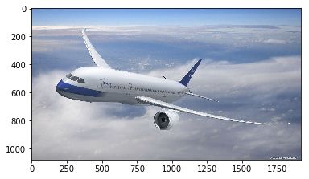


    
    There's about a 100.000% chance that there is at least one airplane in the image
    
    The whole probability distribution:
    
    airplane: 100.000%
    automobile: 0.000%
    bird: 0.000%
    cat: 0.000%
    deer: 0.000%
    dog: 0.000%
    frog: 0.000%
    horse: 0.000%
    ship: 0.000%
    truck: 0.000%
    
    Enter relative path to the image: cartoonaeroplane.png


    
    There's about a 70.990% chance that there is at least one airplane in the image
    
    The whole probability distribution:
    
    airplane: 70.990%
    automobile: 28.987%
    bird: 0.019%
    cat: 0.001%
    deer: 0.000%
    dog: 0.000%
    frog: 0.000%
    horse: 0.000%
    ship: 0.002%
    truck: 0.000%
    
    Enter relative path to the image: car1.jpg


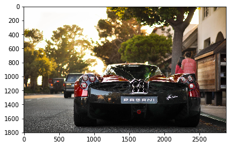


    
    There's about a 97.054% chance that there is at least one automobile in the image
    
    The whole probability distribution:
    
    airplane: 0.000%
    automobile: 97.054%
    bird: 0.000%
    cat: 0.000%
    deer: 0.000%
    dog: 0.000%
    frog: 0.000%
    horse: 0.000%
    ship: 0.000%
    truck: 2.945%
    
    Enter relative path to the image: car2.jpg


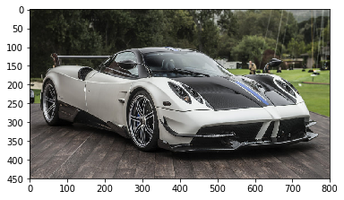


    
    There's about a 100.000% chance that there is at least one automobile in the image
    
    The whole probability distribution:
    
    airplane: 0.000%
    automobile: 100.000%
    bird: 0.000%
    cat: 0.000%
    deer: 0.000%
    dog: 0.000%
    frog: 0.000%
    horse: 0.000%
    ship: 0.000%
    truck: 0.000%
    
    Enter relative path to the image: car3.jpg


    
    There's about a 99.126% chance that there is at least one automobile in the image
    
    The whole probability distribution:
    
    airplane: 0.005%
    automobile: 99.126%
    bird: 0.000%
    cat: 0.001%
    deer: 0.000%
    dog: 0.000%
    frog: 0.002%
    horse: 0.001%
    ship: 0.003%
    truck: 0.864%
    
    Enter relative path to the image: car4.jpg


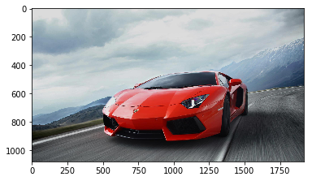


    
    There's about a 100.000% chance that there is at least one automobile in the image
    
    The whole probability distribution:
    
    airplane: 0.000%
    automobile: 100.000%
    bird: 0.000%
    cat: 0.000%
    deer: 0.000%
    dog: 0.000%
    frog: 0.000%
    horse: 0.000%
    ship: 0.000%
    truck: 0.000%
    
    Enter relative path to the image: bird1.jpg


    
    There's about a 100.000% chance that there is at least one bird in the image
    
    The whole probability distribution:
    
    airplane: 0.000%
    automobile: 0.000%
    bird: 100.000%
    cat: 0.000%
    deer: 0.000%
    dog: 0.000%
    frog: 0.000%
    horse: 0.000%
    ship: 0.000%
    truck: 0.000%
    
    Enter relative path to the image: bird2.jpg


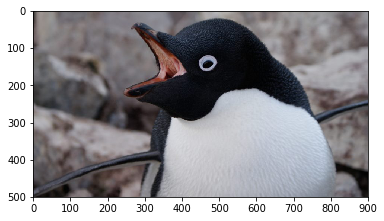


    
    There's about a 99.986% chance that there is at least one bird in the image
    
    The whole probability distribution:
    
    airplane: 0.014%
    automobile: 0.000%
    bird: 99.986%
    cat: 0.001%
    deer: 0.000%
    dog: 0.000%
    frog: 0.000%
    horse: 0.000%
    ship: 0.000%
    truck: 0.000%
    
    Enter relative path to the image: bird3.jpg


    
    There's about a 99.551% chance that there is at least one horse in the image
    
    The whole probability distribution:
    
    airplane: 0.001%
    automobile: 0.000%
    bird: 0.021%
    cat: 0.002%
    deer: 0.373%
    dog: 0.053%
    frog: 0.001%
    horse: 99.551%
    ship: 0.000%
    truck: 0.000%
    
    Enter relative path to the image: cat1.jpg


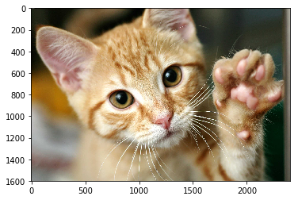


    
    There's about a 95.607% chance that there is at least one cat in the image
    
    The whole probability distribution:
    
    airplane: 0.000%
    automobile: 0.000%
    bird: 0.052%
    cat: 95.607%
    deer: 0.001%
    dog: 4.319%
    frog: 0.022%
    horse: 0.000%
    ship: 0.000%
    truck: 0.000%
    
    Enter relative path to the image: cat2.jpeg


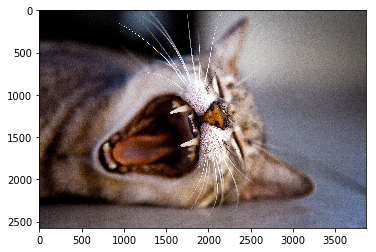


    
    There's about a 96.047% chance that there is at least one dog in the image
    
    The whole probability distribution:
    
    airplane: 0.000%
    automobile: 0.000%
    bird: 0.453%
    cat: 3.372%
    deer: 0.122%
    dog: 96.047%
    frog: 0.003%
    horse: 0.000%
    ship: 0.003%
    truck: 0.000%
    
    Enter relative path to the image: cat3.jpg


    
    There's about a 99.943% chance that there is at least one cat in the image
    
    The whole probability distribution:
    
    airplane: 0.000%
    automobile: 0.000%
    bird: 0.000%
    cat: 99.943%
    deer: 0.000%
    dog: 0.057%
    frog: 0.000%
    horse: 0.000%
    ship: 0.000%
    truck: 0.000%
    
    Enter relative path to the image: deer1.jpg


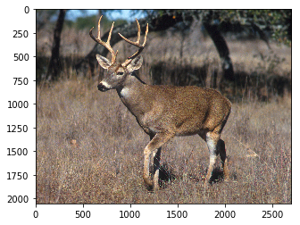


    
    There's about a 100.000% chance that there is at least one deer in the image
    
    The whole probability distribution:
    
    airplane: 0.000%
    automobile: 0.000%
    bird: 0.000%
    cat: 0.000%
    deer: 100.000%
    dog: 0.000%
    frog: 0.000%
    horse: 0.000%
    ship: 0.000%
    truck: 0.000%
    
    Enter relative path to the image: deer2.jpg


    
    There's about a 72.604% chance that there is at least one bird in the image
    
    The whole probability distribution:
    
    airplane: 0.422%
    automobile: 0.000%
    bird: 72.604%
    cat: 0.000%
    deer: 25.153%
    dog: 0.000%
    frog: 1.821%
    horse: 0.000%
    ship: 0.000%
    truck: 0.000%
    
    Enter relative path to the image: deer3.jpg


    
    There's about a 99.965% chance that there is at least one deer in the image
    
    The whole probability distribution:
    
    airplane: 0.000%
    automobile: 0.000%
    bird: 0.034%
    cat: 0.000%
    deer: 99.965%
    dog: 0.000%
    frog: 0.000%
    horse: 0.000%
    ship: 0.000%
    truck: 0.000%
    
    Enter relative path to the image: dog1.jpg


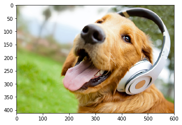


    
    There's about a 99.901% chance that there is at least one dog in the image
    
    The whole probability distribution:
    
    airplane: 0.000%
    automobile: 0.000%
    bird: 0.080%
    cat: 0.018%
    deer: 0.000%
    dog: 99.901%
    frog: 0.001%
    horse: 0.001%
    ship: 0.000%
    truck: 0.000%
    
    Enter relative path to the image: dog2.jpg


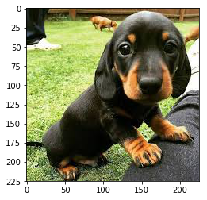


    
    There's about a 100.000% chance that there is at least one dog in the image
    
    The whole probability distribution:
    
    airplane: 0.000%
    automobile: 0.000%
    bird: 0.000%
    cat: 0.000%
    deer: 0.000%
    dog: 100.000%
    frog: 0.000%
    horse: 0.000%
    ship: 0.000%
    truck: 0.000%
    
    Enter relative path to the image: dog3.jpg


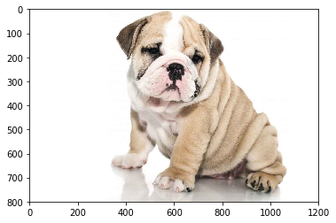


    
    There's about a 99.999% chance that there is at least one dog in the image
    
    The whole probability distribution:
    
    airplane: 0.000%
    automobile: 0.000%
    bird: 0.000%
    cat: 0.001%
    deer: 0.000%
    dog: 99.999%
    frog: 0.000%
    horse: 0.000%
    ship: 0.000%
    truck: 0.000%
    
    Enter relative path to the image: cartoondog.png


    
    There's about a 57.800% chance that there is at least one dog in the image
    
    The whole probability distribution:
    
    airplane: 2.312%
    automobile: 0.000%
    bird: 14.730%
    cat: 0.510%
    deer: 14.800%
    dog: 57.800%
    frog: 0.317%
    horse: 9.531%
    ship: 0.000%
    truck: 0.000%
    
    Enter relative path to the image: catdog1.jpg


    
    There's about a 100.000% chance that there is at least one dog in the image
    
    The whole probability distribution:
    
    airplane: 0.000%
    automobile: 0.000%
    bird: 0.000%
    cat: 0.000%
    deer: 0.000%
    dog: 100.000%
    frog: 0.000%
    horse: 0.000%
    ship: 0.000%
    truck: 0.000%
    
    Enter relative path to the image: catdog2.jpg


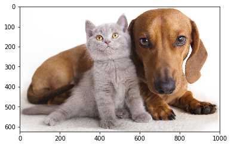


    
    There's about a 67.493% chance that there is at least one cat in the image
    
    The whole probability distribution:
    
    airplane: 0.000%
    automobile: 0.000%
    bird: 0.000%
    cat: 67.493%
    deer: 0.000%
    dog: 32.504%
    frog: 0.000%
    horse: 0.004%
    ship: 0.000%
    truck: 0.000%
    
    Enter relative path to the image: frog1.jpg


    
    There's about a 93.749% chance that there is at least one frog in the image
    
    The whole probability distribution:
    
    airplane: 0.000%
    automobile: 0.000%
    bird: 6.251%
    cat: 0.000%
    deer: 0.000%
    dog: 0.000%
    frog: 93.749%
    horse: 0.000%
    ship: 0.000%
    truck: 0.000%
    
    Enter relative path to the image: frog2.jpg


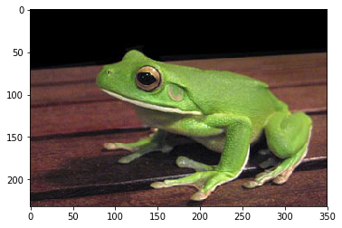


    
    There's about a 100.000% chance that there is at least one frog in the image
    
    The whole probability distribution:
    
    airplane: 0.000%
    automobile: 0.000%
    bird: 0.000%
    cat: 0.000%
    deer: 0.000%
    dog: 0.000%
    frog: 100.000%
    horse: 0.000%
    ship: 0.000%
    truck: 0.000%
    
    Enter relative path to the image: frog3.jpg


    
    There's about a 96.741% chance that there is at least one frog in the image
    
    The whole probability distribution:
    
    airplane: 0.000%
    automobile: 2.681%
    bird: 0.576%
    cat: 0.002%
    deer: 0.000%
    dog: 0.000%
    frog: 96.741%
    horse: 0.000%
    ship: 0.000%
    truck: 0.000%
    
    Enter relative path to the image: horse1.jpg


    
    There's about a 100.000% chance that there is at least one horse in the image
    
    The whole probability distribution:
    
    airplane: 0.000%
    automobile: 0.000%
    bird: 0.000%
    cat: 0.000%
    deer: 0.000%
    dog: 0.000%
    frog: 0.000%
    horse: 100.000%
    ship: 0.000%
    truck: 0.000%
    
    Enter relative path to the image: horse2.jpg


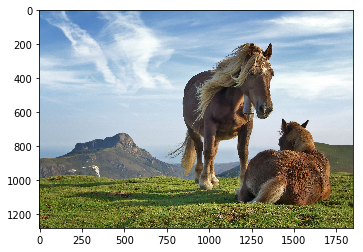


    
    There's about a 94.826% chance that there is at least one horse in the image
    
    The whole probability distribution:
    
    airplane: 0.000%
    automobile: 0.000%
    bird: 0.000%
    cat: 0.011%
    deer: 0.001%
    dog: 0.003%
    frog: 0.000%
    horse: 94.826%
    ship: 0.000%
    truck: 5.159%
    
    Enter relative path to the image: ship1.jpg


    
    There's about a 99.971% chance that there is at least one airplane in the image
    
    The whole probability distribution:
    
    airplane: 99.971%
    automobile: 0.000%
    bird: 0.017%
    cat: 0.001%
    deer: 0.000%
    dog: 0.002%
    frog: 0.000%
    horse: 0.001%
    ship: 0.008%
    truck: 0.000%
    
    Enter relative path to the image: ship2.jpg


    
    There's about a 95.020% chance that there is at least one ship in the image
    
    The whole probability distribution:
    
    airplane: 4.504%
    automobile: 0.000%
    bird: 0.244%
    cat: 0.230%
    deer: 0.000%
    dog: 0.002%
    frog: 0.000%
    horse: 0.000%
    ship: 95.020%
    truck: 0.000%
    
    Enter relative path to the image: ship3.jpeg


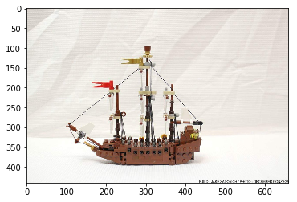


    
    There's about a 100.000% chance that there is at least one ship in the image
    
    The whole probability distribution:
    
    airplane: 0.000%
    automobile: 0.000%
    bird: 0.000%
    cat: 0.000%
    deer: 0.000%
    dog: 0.000%
    frog: 0.000%
    horse: 0.000%
    ship: 100.000%
    truck: 0.000%
    
    Enter relative path to the image: truck1.jpg


    
    There's about a 96.710% chance that there is at least one airplane in the image
    
    The whole probability distribution:
    
    airplane: 96.710%
    automobile: 0.000%
    bird: 0.048%
    cat: 0.044%
    deer: 0.000%
    dog: 0.000%
    frog: 0.000%
    horse: 0.021%
    ship: 0.343%
    truck: 2.833%
    
    Enter relative path to the image: truck2.jpg


    
    There's about a 100.000% chance that there is at least one truck in the image
    
    The whole probability distribution:
    
    airplane: 0.000%
    automobile: 0.000%
    bird: 0.000%
    cat: 0.000%
    deer: 0.000%
    dog: 0.000%
    frog: 0.000%
    horse: 0.000%
    ship: 0.000%
    truck: 100.000%
    
    Enter relative path to the image: truck3.jpg


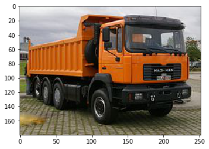


    
    There's about a 100.000% chance that there is at least one truck in the image
    
    The whole probability distribution:
    
    airplane: 0.000%
    automobile: 0.000%
    bird: 0.000%
    cat: 0.000%
    deer: 0.000%
    dog: 0.000%
    frog: 0.000%
    horse: 0.000%
    ship: 0.000%
    truck: 100.000%
    
    Enter relative path to the image: STOP


```python

```
